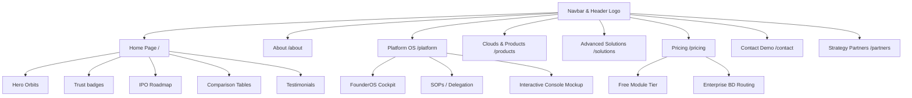

# Sangoe Brand Design & Technical Architecture Specification

This document details the system design, brand philosophy, visual guidelines, UI components, pages, and interactive features of the **Sangoe Business Growth Operating System** website.

---

## 1. System Philosophy & Brand Vision

Sangoe is positioned not simply as another SaaS or CRM, but as a complete **Business Growth Operating System (OS)**. The site's copy and structural flow are designed to highlight a transition from **Founder Dependency & Operational Chaos** to **Scalable Corporate Governance & IPO Readiness**.

### Core Brand Pillars
*   **Chaos to Clarity**: Shifting workflows from scattered spreadsheets, WhatsApp chats, and fragmented tools into one unified command center.
*   **System-Driven Scale**: Structuring companies to grow independently of any single individual by embedding Standard Operating Procedures (SOPs), delegation matrices, and clear compliance safeguards.
*   **Institutional Governance**: Providing due diligence tools, ESG trackers, audit logs, and digital boardrooms to prepare MSMEs and enterprise platforms for public listing (IPO).

---

## 2. Visual Design System

The visual design is a premium, dark-themed agency aesthetic combined with clean light-theme surfaces for datacentric mockups. It leverages vibrant accent colors, radial glows, subtle vector grids, and smooth GPU-accelerated micro-animations.

### A. Color Palette

#### Primary Theme Accent
*   **Brand Purple**: `#7C3AED` (HSL: `262°, 83%, 58%`)
*   **Purple Glow**: `rgba(124, 58, 237, 0.15)`

#### Interactive & Alert Color Tokens
*   **Success (Yes/Checked)**: `#10B981` (Emerald Green)
*   **Failure (No/Crossed)**: `#EF4444` (Ruby Red)
*   **Partial/Warning (Limited)**: `#F59E0B` (Amber Yellow)

#### Light Mode Tokens
*   **Global Background**: `#ffffff`
*   **Secondary Background**: `#f9fafb`
*   **Border Gray**: `rgba(0, 0, 0, 0.05)`
*   **Text Main**: `#111827` (Dark Slate)
*   **Text Sub**: `#6b7280` (Muted Slate)

#### Dark Mode Tokens
*   **Global Background**: `#0b0b16`
*   **Section Background**: `#0e0e1a`
*   **Card Background**: `#1c1c2e`
*   **Border Light**: `rgba(255, 255, 255, 0.07)`
*   **Text Main**: `#edeaf8` (Warm White)
*   **Text Sub**: `#8b85a8` (Muted Purple-Gray)

---

### B. Typography & Layout Metrics
*   **Main Headings**: Styled with `font-weight: 950` and letter-spacing `-0.03em`. Font size clamp is used to guarantee responsiveness:
    ```css
    font-size: clamp(2.4rem, 4.8vw, 4rem);
    ```
*   **Paragraphs**: Text blocks have a line-height of `1.75` to maximize legibility.
*   **Subheadings & Labels**: Heavy capital case weights (`font-weight: 800`, `letter-spacing: 0.06em`).

---

### C. Visual Components & Animations

#### 1. Universe Revolving Orbits (HeroUniverse)
A high-impact header animation centered in the hero section displaying six operational spheres orbiting a central cockpit text node.
*   **Elliptical Orbits**: Concentric absolute SVGs rotated to simulate a 3D perspective plane.
*   **Revolving Planets**:
    *   *Support* (Yellow)
    *   *Sales* (Blue)
    *   *Automation* (Orange)
    *   *Analytics* (Purple)
    *   *Service* (Teal)
    *   *Marketing* (Green)
*   **GPU Keyframes**: Planets revolve using custom bezier keyframes that translate, scale down (`0.8`), and drop opacity (`0.6`) when passing "behind" text elements, and scale up (`1.15`), bright-glow, and increase z-index (`12`) when moving in front.

#### 2. Mobile Swipe Arrows (`swipePulse`)
An horizontal alert arrow element placed next to comparison table headings on mobile breakpoints (`max-width: 1024px`).
*   **Visual Structure**: Styled pill-badge displaying "Swipe Right →".
*   **CSS Keyframe**:
    ```css
    @keyframes swipePulse {
      0%, 100% { transform: translateX(0); }
      50% { transform: translateX(4px); }
    }
    ```

#### 3. Premium Trust Pill Badges
Visual cards representing core platform compliance guarantees, configured with distinct colors, hover-lift offsets, and dark-theme adaptability.
*   **SSL (Lock)**: Saffron/Emerald `#10b981` border with soft background.
*   **Made in India (Heart)**: Saffron `#f97316` accent border.
*   **MSME (Briefcase)**: Royal blue `#3b82f6` border.
*   **GDPR (FileCheck)**: Orchid purple `#a855f7` border.
*   **SOC 2 (ShieldCheck)**: Amethyst `#7c3aed` border.
*   **Hover Lift Effect**: Translates upwards by `2px` and scales shadows smoothly.

---

## 3. Web Pages & Features Architecture



### A. Homepage Section Flow (app/page.js)
1.  **Hero Section (`HeroPremium`)**: Dynamic brand tagline + Call to Actions.
2.  **Trust Strip Logos**: Scrolling marquees of trusted enterprise partners (filtering out the Sangoe logo).
3.  **One Platform Command Center (`SolutionStatement` & `MissionStatement`)**: Transitioning from chaos to scalable dashboards.
4.  **Explore CRM & ERP Features (`FeaturesOverview`)**: Interactive directory grids.
5.  **IPO Journey & Growth Roadmap (`IPORoadmap` + `JourneySection`)**: Real user metrics and timeline tracking.
6.  **Operational Chaos (`ProblemSection`)**: Direct comparison list of system blockers vs unified clarity.
7.  **Comparison Matrices (`WhySangoe` tables)**:
    *   *Traditional Comparison*: Zoho One vs Odoo vs Salesforce vs Monday vs Asana vs Freshworks vs Sangoe (23 core capabilities).
    *   *Exclusive Capabilities*: GDPR, ESG, Board room logs, background checks, fleet management, and IPO readiness registers.
8.  **Advanced Modules & Final CTA**: Interactive health assessment redirects.

---

### B. Core Business Clouds (9 Clouds Grid)
Sangoe houses 50+ business modules classified under nine core business clouds:
1.  **Sales & Revenue**: Lead Finder, subscription contract handlers, revenue pipelines.
2.  **HR & Workforce**: Leaves, timesheets, HR records, automated payroll engines.
3.  **Project & Operations**: SOP document control boards, ticket desks.
4.  **Procurement & Finance**: Purchases, invoices, inventory ledgers, vendor ledgers.
5.  **Assets & Infra**: Vehicles, equipment logs, domain names, utility calculators.
6.  **Compliance & Governance**: ESG monitors, audit registers, compliance alert clocks.
7.  **Business Intelligence**: Custom scorecards, OKR dashboards, forecast projections.
8.  **Customer Success**: NPS survey triggers, client knowledge base dashboards.
9.  **SaaS & Ecosystem**: Multi-tenant billing, developer API gateways.

---

### C. Advanced Transformation Solutions
Specialized packages built to de-risk growth and manage due diligence:
*   **MSME Transformation System™**: SOP registers and delegation tracking.
*   **Compliance Control Tower™**: PF, ESIC, labour law tracking.
*   **Trust Intelligence Platform™**: QuickVerification background checks.
*   **ESG & Sustainability Platform™**: Carbon emission calculators.
*   **Safety Management System™**: Digital permit to work logs.
*   **Investor & IPO Readiness Platform™**: Boardroom governance and secure data vaults.

---

## 4. Interactive Elements & State Design

### A. Dynamic Console Mockup Shell
Used in `/platform`, `/features`, and `/products` to show live mockup consoles.
*   **Interface Shell**: Designed as a modern browser window mockup with minified status bars and navigation tabs.
*   **Responsive Adaptation**:
    *   *Desktop view*: Left-positioned sidebar menu + center dashboard layout panel.
    *   *Mobile view*: Sidebar collapses automatically, category selectors switch to an overlay drop-down list positioned in the main header workspace (controlled via click-outside detection hooks).
*   **Interactive submodules**: Includes custom modules for revenue timelines (Profit vs Expense dual bar chart), Kanban boards, mailbox layouts, directories, and chatbot bubbles.

### B. Dynamic Contact Form Selection
The contact form allows users to toggle multiple requested operational services.
*   **State Persistence**: Selected services are passed dynamically through query parameters (`serviceIds`). If a user hits "Change Services", the state of previously checked parameters is preserved during navigation.
*   **Render Loop Protection**: `useMemo` hooks check joined-string changes of preselected IDs, preventing React state refresh loops on sub-selections.

---

## 5. Technical Architecture & Integrations

### A. SMTP Email Router API
Integrated server-side email routing endpoints using standard secure configurations:
*   **API Routes**:
    *   `/api/contact`: Form data for product demos.
    *   `/api/partner`: Form data for partner integrations (includes name, company, email, phone, model).
    *   `/api/newsletter`: Newsletter subscription captures.
*   **Nodemailer Configuration**: Connects to the local corporate mail gateway (`mail.sangoe.in:587`) using TLS self-signed bypass rules and quoted credentials to prevent hash character comment parser crashes.

### B. Route Strategy
*   **Static Pages (○)**: Pages like `/`, `/about`, `/pricing`, `/products` are pre-rendered at compile time for fast page speed.
*   **Dynamic Routes (ƒ)**: Interactive dashboards and custom service layouts `/services/[slug]` render dynamically on demand.
*   **SSG Pages (●)**: Privacy policies and legal templates `/legal/[slug]` use static parameters for SEO crawlers.
